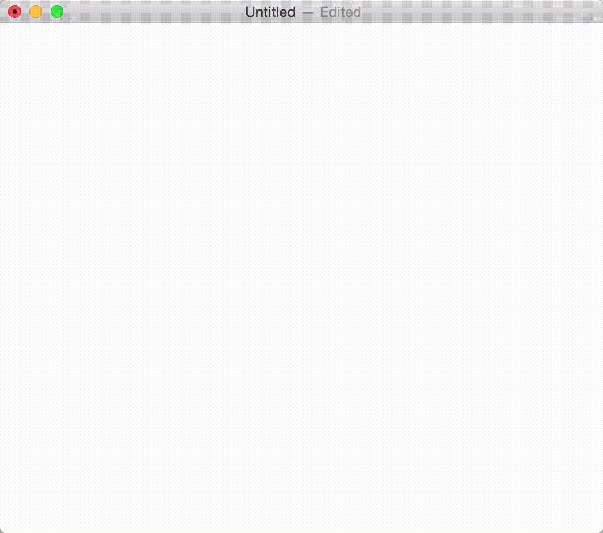

此文的目的是记录下在使用macOS过程中个人觉得还不错的习惯、还不错的软件，帮助大家喜欢上使用Mac……

更新中……

<!---more--->

> 文内图片找回中，七牛真坑，图片原外链不让访问，还不让下载

> 个人观点：
>
> 1. macOS在易用性上完爆Windows，Windows只适合用来娱乐和一些必须要用一些不支持macOS或支持得不好的软件的场景（本人使用到的98%的软件都有mac版本，或者有可替代的软件，甚至只有mac版本）
> 2. 尤其是开发同学，强烈建议使用Mac，个人从Windows转移到Mac并熟悉了系统之后，开发效率提高了至少一倍
> 3. 个人建议千万不要做双系统，非要用Windows系统还不如再买个Windows电脑

## 还不错的习惯

1. 多用快捷键，mac的快捷键设计的很合理，不像臭名昭著的win键
2. ``Command``键用左手大拇指按
3. 使用``caps lock``（大小写锁定）键来切换中英文
4. 把系统设置里所有东西都过一遍，设置``触发脚``，显示桌面/进入屏保，很方便
5. 多用``Spotlight``，很方便，比如
   - 打开应用（建议输入英文名因为快）
   - 文档搜索
   - 直接输入算式以计算
   - 汇率计算（输入：1美元）
   - 单词翻译
6. 如果用的是Mac笔记本/有触控板的话，尽量不要用鼠标

## 还不错的软件

### 常用软件

> 因为这个类别没什么技术含量，基本上所有用mac的人都会用，所以不详细说明，只是列举出来

微信、网易云音乐、Chrome、网易邮箱大师、Thunder、百度网盘、腾讯视频等

### 文本软件

> 1. Office三件套有mac版本，但是用起来觉得一般般，总是卡顿，很少用
> 2. Mac办公三件套（Page、Keynote、Numbers）用起来很舒服，且很容易上手，也能导出为office的格式，推荐使用

#### Markdown编辑器： Typora

> 个人很钟爱用markdown格式写文本，因为可以通过使用简单符号的方式快速排版，这样可以让自己专注在写作上，而不是用在排版这种浪费时间的事情上（对于记录这个行为来说），个人也很建议平时写文档使用markdown格式来记录
>
> 关于markdown的介绍可以看这里：
>
> - [维基百科：Markdown](https://zh.wikipedia.org/wiki/Markdown)
> - [Github中star数最高的Markdown介绍](https://github.com/younghz/Markdown)
> - [简书：Markdown新手指南](https://www.jianshu.com/p/q81RER)

本人使用过很多Markdown编辑器，多数设计的风格是编辑区和渲染效果区左右分开，

当发现Typora这个软件之后内心的想法是：

1. 卧槽真特么好用，只有正在输入的地方显示编辑效果，其它地方显示的是渲染效果
2. 卧槽界面真舒服，浓浓的性冷淡风，还支持很多渲染主题
3. 卧槽真特么良心，各种格式几乎都有快捷键，所有markdown语法还都支持，还支持中文
4. 卧槽这软件做的这么好还是免费的

[Typora官网及下载链接](https://typora.io/)

#### 笔记工具： 有道云笔记

本人也使用过很多笔记软件做过横向对比，比如常见的印象笔记、为知笔记、OneNote，也用过小众的Leanote，在综合考虑以下几个方面的原因后，最终选择了有道云笔记+系统自带Notes+个人网站

1. 同步功能
2. Markdown支持
3. 操作舒适度及界面风格
4. 免费版功能已足够日常使用

[官网及下载链接](https://note.youdao.com/)

### 计划软件

> 本人对于这类软件要求不是很高，正在使用的是前两个

#### Reminders + Calendar

系统自带的两个应用，个人觉得已经满足大部分人的需求，界面还算友好，操作不算复杂，重点是在mac和手机上同步得很快

#### Clear

操作、界面都很简洁，能够满足平时需要，但是缺点是不能看历史记录

ps 需付费

[AppStore 链接](https://itunes.apple.com/cn/app/clear-%E4%BB%BB%E5%8A%A1%E5%92%8C%E5%BE%85%E5%8A%9E%E4%BA%8B%E9%A1%B9%E6%B8%85%E5%8D%95/id504544917?mt=12)

#### Omni系列

应对较复杂的场景，自己用过一次放弃了，不需要这么复杂

[AppStore 链接](https://itunes.apple.com/cn/app/omnifocus-2/id867299399?mt=12)

### 工具软件

#### 剪贴板 - Paste

强烈推荐，用着巨舒服，``Command+Shift+v``会显示剪贴板历史，且几乎支持所有格式

[AppStore 链接](https://itunes.apple.com/cn/app/paste-2/id967805235?mt=12)

#### 截图工具 - Snipaste

微软出品的良心软件，功能比同类软件强大很多，且操作也很舒服，和Paste配合起来天衣无缝

ps1 之前用过腾讯的Jietu、Xnip等始终不满意，发现Snipaste之后简直破费，使用方便、功能全、UI舒服

ps2 建议在使用这个软件的时候把其他应用自带的截图工具快捷键取消掉

[Snipaste官网及下载](https://zh.snipaste.com/)

#### 图床工具 - iPic / PicU

作为一个以markdown为最常用书写方式的人，图床工具是很必要的（因为markdown插入图片的方式是插入图片的链接），一键上传，一键复制为markdown格式，美滋滋，妥妥的生产力

发现了两个图床工具都很好用，iPic免费版只支持微博图床，PicU是一个开发者模仿iPic开发的工具，很强

[iPic AppStore链接](https://itunes.apple.com/cn/app/ipic-%E5%9B%BE%E5%BA%8A%E7%A5%9E%E5%99%A8-markdown-%E5%86%99%E4%BD%9C%E5%BF%85%E5%A4%87/id1101244278?mt=12)

[PicU Github地址](https://github.com/chenxtdo/UPImageMacApp)

[PicU 简书介绍地址](https://www.jianshu.com/p/66d453d99c71)

#### 清理工具 - CleanMyMac3

虽然说mac正常情况下不需要清理，如果实在是磁盘没地方的话清理下也不错，CleanMyMac是很有名的老牌清理工具，能发现这么老多系统垃圾我也是很震惊

[CleanMyMac官网及下载](https://cleanmymac.com/)

### 

### 编程软件

#### 编译器 - Jetbrains公司全系列产品

在用过CodeBlocks、Netbeans、Eclipse等很多个编译器，在接触到Jetbrains公司的编译器产品后发现真特么舒服，再也不会换编译器了，优点大概是

- 强大、迅速、友好等等该有的随便吹
- 各种语言都有对应的产品，还有数据库、持续集成等的产品
- 快捷键很多很舒服（一定要多用快捷键）
- 插件很多质量很高，自己写也较简单

[Jetbrains官网](https://www.jetbrains.com/)

[Java编译器 - IDEA](https://www.jetbrains.com/idea/)

[Python编译器 - PyCharm](https://www.jetbrains.com/pycharm/)

[C编译器 - CLion](https://www.jetbrains.com/clion/)

[Web编译器 - WebStorm](https://www.jetbrains.com/webstorm/)

> 激活方式：（毕竟几千块还是有点贵……）
>
> 1. 自行搜索，有大神的激活教程
> 2. 学生可以进行学生认证，学生认证后免费使用

#### API文档工具 - Dash

支持的语言很丰富，各种语言的API文档

[Dash官网及下载](https://kapeli.com/dash)

#### 抓包工具 - Charles

功能巨强大，前端客户端开发必备

[Charles官网及下载](https://www.charlesproxy.com/)

