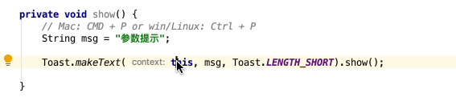
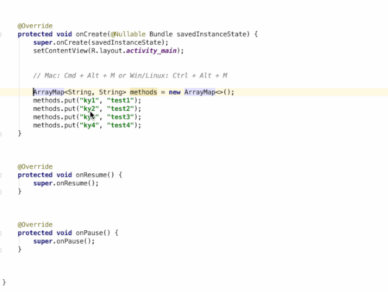
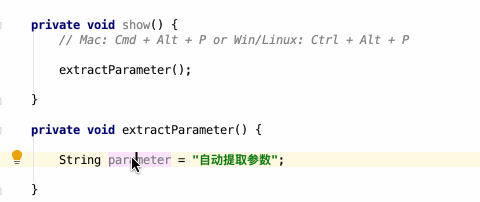
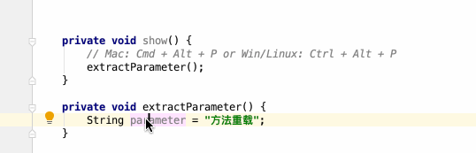
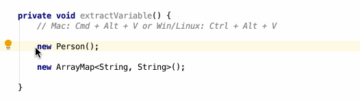
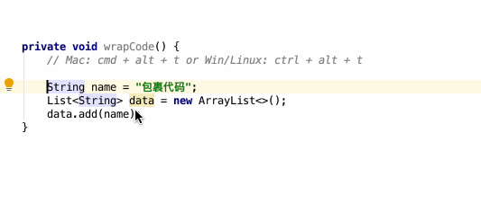
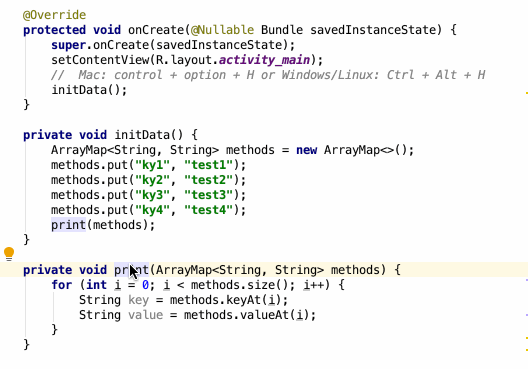
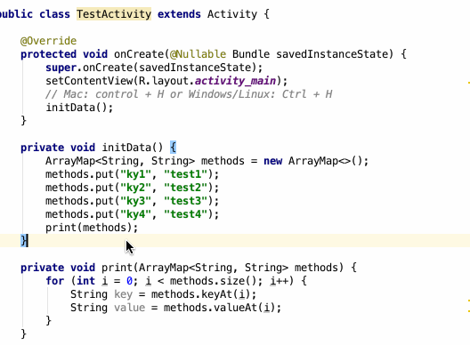
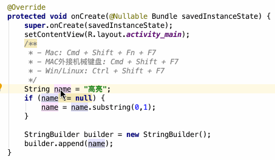

开发过程中灵活使用编译器快捷键可以大大增加开发效率

动图过段时间补

<!---more--->

#### 查找类

 `Command + O`

#### 查找文件

 `Command + Shift + O`

#### 查看当前类的成员

`Command + F12`

打开命令行工具

`Option + F12`

#### 立刻换行

`Command + Shift + Return`

#### Git Pull

 `Command + T`

#### Git Commit

 `Command + K`

#### Generate Code

`Control + Return` / `Command + N`

#### Implement Methods

`Control + I`

#### Override Methods

`Control + O`

#### 参数提示 `Command + P`

#### 自动提取方法 `Command + Alt + M `

#### 自动提取参数 `Command + Alt + P`

#### 自动生成变量 `Command + Alt + V`

#### 包裹代码 `Command + Alt + T`

#### 方法调用层级 `Command + Option + H`

#### 类的层次结构 `Control + H`

#### 变量高亮 `Command + Shift + F7`

#### 跳转到父类 `Command + U`

