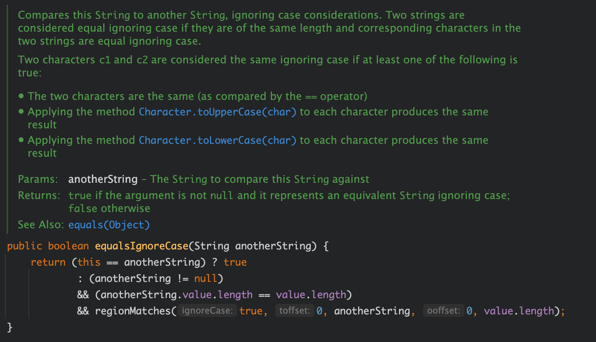
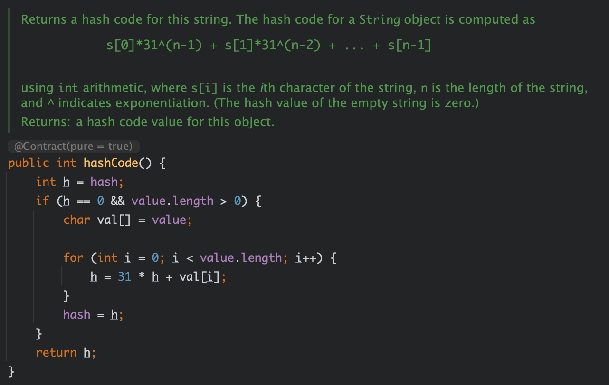
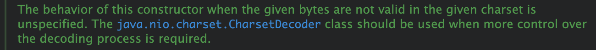
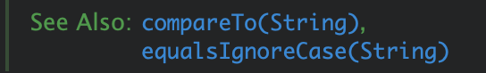
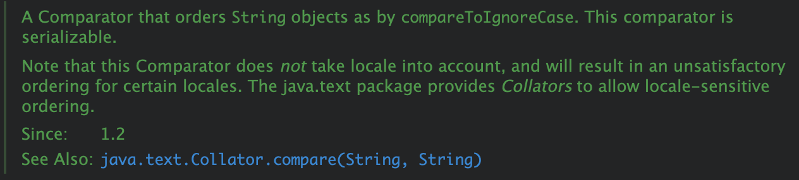
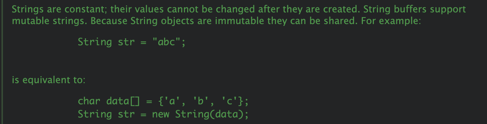
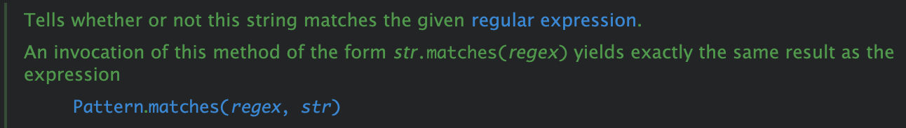

最近看 JDK 源码的时候发现人家的注释结合 Intellij 的 [Toggle Rendered View](https://blog.jetbrains.com/idea/2020/03/intellij-idea-2020-1-eap8/) 功能展示的注释真好看，学一波，让自己写的注释也更好看些 HOHO

<!---more--->

### **0x01 "别人家的孩子" - JDK 源码**





### **0x02 基础篇 - 基础标签**

使用 javadoc 工具识别的常用标签

| 标签        | 描述                         |
| ----------- | ---------------------------- |
| @author     | 标识一个类的作者             |
| @deprecated | 标识本类/成员已过期（废弃）  |
| @param      | 说明一个方法的参数           |
| @return     | 说明返回值                   |
| @since      | 标记当引入一个特定变化的时机 |
| @version    | 说明类的版本                 |

> 完整标签参考:  [javadoc 工具识别的标签 完整文档](https://www.runoob.com/java/java-documentation.html)

### **0x03 进阶篇 - 标签与HTML**

#### 1. see / link 标签

能够很好的在注释中添加工程中指定代码的类/成员的引用，并高亮、支持点击做跳转

##### 引用类



```java
/**
 * The behavior of this constructor when the given bytes are not valid
 * in the given charset is unspecified.  The {@link
 * java.nio.charset.CharsetDecoder} class should be used when more control
 * over the decoding process is required.
 */
```


##### 引用自身成员



```java
/**
 * @see  #compareTo(String)
 * @see  #equalsIgnoreCase(String)
 */
```


##### 引用其他类成员



```java
/**
 * A Comparator that orders {@code String} objects as by
 * {@code compareToIgnoreCase}. This comparator is serializable.
 * <p>
 * Note that this Comparator does <em>not</em> take locale into account,
 * and will result in an unsatisfactory ordering for certain locales.
 * The java.text package provides <em>Collators</em> to allow
 * locale-sensitive ordering.
 *
 * @see     java.text.Collator#compare(String, String)
 * @since   1.2
 */
```


##### see 标签与 link 标签的区别

- see 标签只能在行首使用
- link 标签可以在行的任意位置，且需要用大括号包裹


##### link 标签与 linkplain 标签

- link 标签展示字体特殊
- linkplain 标签展示的字体和注释其他内容相同


#### 2. 列表

java 注释支持大多数的 html 标签，也会展示成对应的样式

##### 无需列表

```java
/**
 * <ul>
 * 无序列表的标题
 *     <li>这是一个条目</li>
 *     <li>这是另一个条目</li>
 * </ul>
 */
```

##### 有序列表

```java
/**
 * <ol>
 * 有序列表的标题
 *     <li>这是条目1</li>
 *     <li>这是条目2</li>
 * </ol>
 */
```


#### 3. 代码块

##### 使用 `blockquote` 标签



```java
/**
 * Strings are constant; their values cannot be changed after they
 * are created. String buffers support mutable strings.
 * Because String objects are immutable they can be shared. For example:
 * <blockquote><pre>
 *     String str = "abc";
 * </pre></blockquote><p>
 * is equivalent to:
 * <blockquote><pre>
 *     char data[] = {'a', 'b', 'c'};
 *     String str = new String(data);
 * </pre></blockquote><p>
 */
```


##### 结合其他标签使样式更美观

如使用 `<i> </i>` 标签显示为斜体



```java
/**
 * Tells whether or not this string matches the given <a
 * href="../util/regex/Pattern.html#sum">regular expression</a>.
 *
 * <p> An invocation of this method of the form
 * <i>str</i>{@code .matches(}<i>regex</i>{@code )} yields exactly the
 * same result as the expression
 *<blockquote>
 * {@link java.util.regex.Pattern}.{@link java.util.regex.Pattern#matches(String,CharSequence)
 * matches(<i>regex</i>, <i>str</i>)}
 * </blockquote>
 */
```


