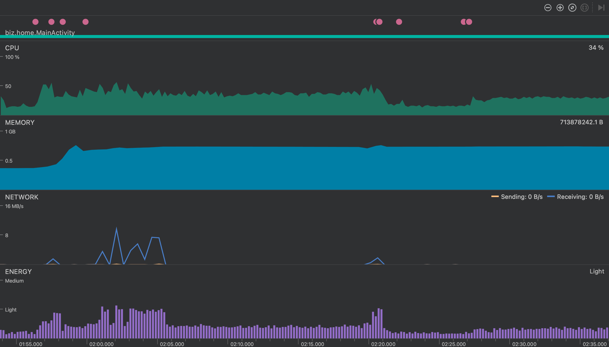
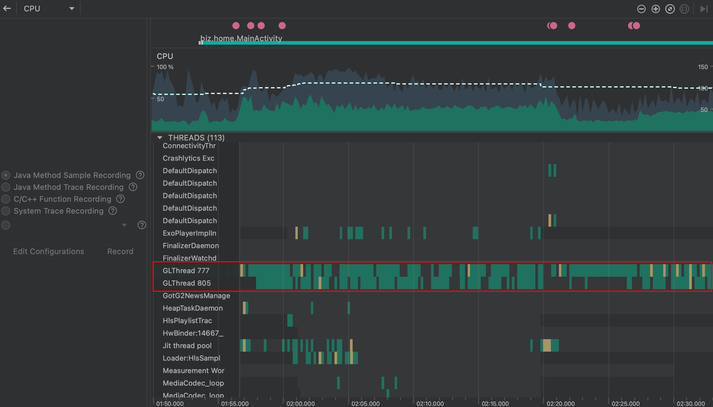
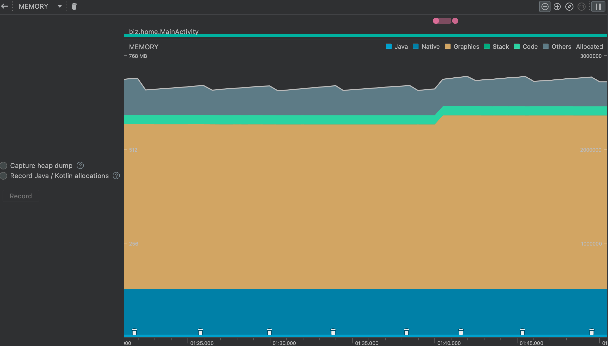
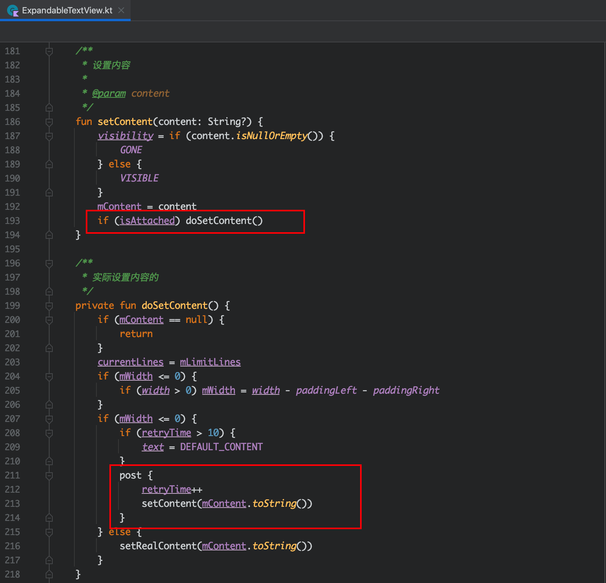

在做新 APP 开发、测试过程中，经常有人反馈手机发热，在优化完自己负责的可能有问题的部分后，发热依旧存在，搞得有点怀疑人生，记录下后续这种有些“无头绪”的问题的排查过程 HOHO

<!---more--->

## 前记

APP 发热，绝大多数情况下根本原因是耗电持续比正常情况下高，像我这种做的不是游戏 APP 这类本身就高功耗的，还出现长时间发热的情况，肯定是代码有问题的

常见的底层原因

- CPU 使用率高
- 内存占用高
- 长时间、高频词的网络请求

常见的代码场景

- 死循环执行代码
- 高内存占用
- 无用内存未释放（内存泄漏）

## 第一回 处理器一直跑该歇歇

性能分析工具，在 Android Studio 版本更新到 3.0 之后，编译器中自带的 Profiler 工具已经很好用，不再需要以前的 Android Monitor、adb 方式

> [Android Profiler 官方介绍](https://developer.android.com/studio/profile/android-profiler)

打开 Profiler 工具后，立刻发现了不对劲，CPU 一直在被使用，切换几个页面后分别静止，CPU 使用率也一直保持在 20% 以上，内心：喝假酒了吧这么亢奋

点击 CPU 区域后可以看到各个线程对于 CPU 的使用情况，发现 GLThread 线程一直把着 CPU 不放，了解新 APP 中只有一块业务需要用到 OpenGL，跟次同学讨论后发现是那个 GLView 全局单例，不在前台时也一直在循环绘制（类似于动画），交给他优化

## 第二回 回收五秒一次太敬业

在看完 CPU 区域后，接下来看内存的情况，点开后发现内存回收次数很多（排查的时候比下面的截图频率高很多，两三秒一次，持续几分钟）

截取 GC 区域后，发现有大量的 String、char[] 数据，引用堆栈指向了 ExpandableTextView 类这个自定义 View

大体查看代码逻辑后发现在 `content` 是空字符串且 `isAttached` 为 true 的时候，会触发死循环，交给写此 View 的同学优化

## 第三回 内存只增不减该整整

观察 Profiler 工具中，内存的变化，发现每打开一个页面内存都会变高 100M 且关闭页面后内存不恢复，查看 `Heap Dump` 确实是发生了不少的内存泄漏

因为几乎每个页面都发生了内存泄漏，所以应当是底层的某些逻辑有问题，交给负责 Activity、Fragment 基础类的同学，排查后发现是 glide 加载图片管理导致的内存泄漏

## 后记

> [性能功耗优化 官方文档](https://developer.android.com/topic/performance?hl=zh-cn)

图像内存占用依旧很高，后续继续优化，主要和 GLView 有关

